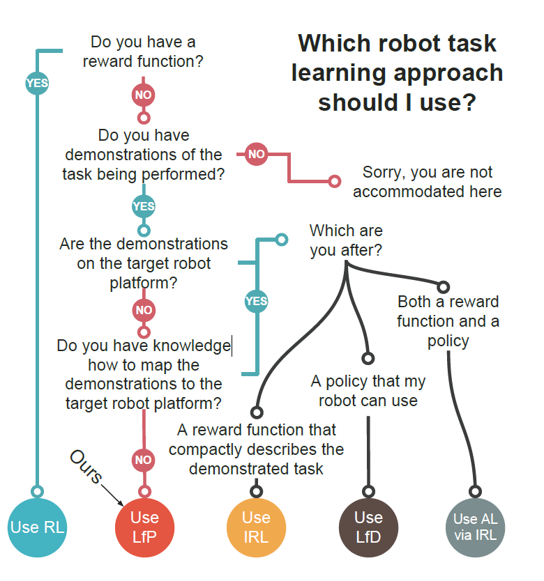

[What Would You Do? Acting by Learning to Predict][What Would You Do]
===
The article learn tasks directly from visual demonstrations by learning to predict the outcome of human and robot actions on an environment.

It use the neural network named PredNet to predicte the state of human by last state and the state of robot space by last state and action.Then robot learns to minimize the two predictions to get the task.

a useful information is taht it gives a classification of imitation learning  

[What Would You Do]:https://arxiv.org/abs/1703.02658v1
